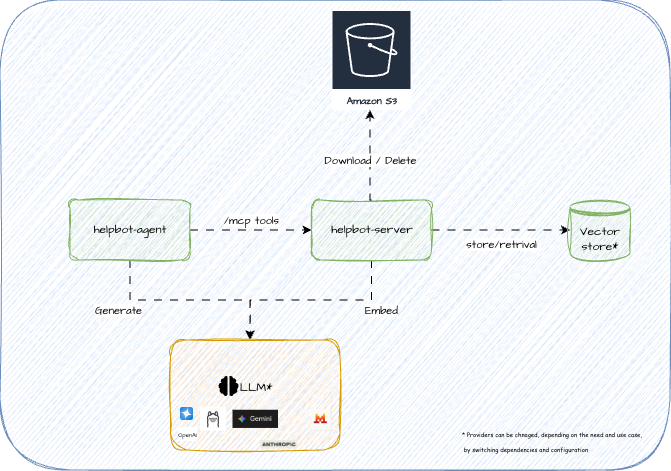

# Architecture

Cross-cutting look at how Helpbot works end to end. Per-module file layouts live in each
module's README; LLM guardrails specifically live in [AGENTIC-HARNESS.md](AGENTIC-HARNESS.md);
cost tradeoffs live in [TOKENOMICS.md](TOKENOMICS.md).



## RAG

Retrieval is an MCP tool the model chooses to call, not a hardcoded pipeline step.

```
question → ChatClient (LLM decides whether to call a tool) → search / search_admin (MCP tool)
         → SearchService → VectorStore.similaritySearch(topK, minSimilarity, filter)
         → matching chunks → back to the model → model composes the final answer
```

- `SearchService` (`helpbot-mcp-server`): `searchPublic()` filters `internal=false`,
  `searchAll()` (backs `search_admin`) allows both.
- `topK`/`minSimilarity` from `helpbot.search.*` (`SearchConfig`) — 5 / 0.35 by default.
- No reranking, no query rewriting — raw question text is embedded and matched directly.
- `internal` metadata (set at ingestion) is the *only* access-control signal — see
  [Agentic Harness](#agentic-harness).

## Ingestion

```
S3 bucket (public/ or internal/ prefix)
  → S3IngestionJob (@Scheduled every 5 min) or POST /api/ingest/all
  → S3DocumentService.ingestFolder(prefix, internal)   lists + downloads via S3Template
  → IngestionService.chunkAndIngest(resource, internal)
      → TikaDocumentReader        parses PDF/DOCX/PPTX/etc. into plain text
      → TokenTextSplitter         chunk-size 384 tokens, max 400 chunks/doc (helpbot.ingestion.chunk-size)
      → metadata tagging          { internal: bool, source: filename }
      → VectorStore.add()         embeds each chunk, upserts into pgvector
  → source object deleted from S3
```

- No diffing/dedup — every run re-embeds and re-adds whatever's in the bucket; re-ingesting the
  same document produces duplicate chunks rather than an update (no content-hash check to
  detect unchanged documents).
- S3 is a transient inbox (deleted after ingest); local source of truth is
  `helpbot-mcp-server/localstack/documents/`.

## MCP

- `helpbot-mcp-server`: 4 tools over Streamable HTTP at `/mcp` — `search`, `search_admin`,
  `createHelpDeskTicket`, `getHelpDeskTicketsByUserId`. Explicit names on `@McpTool` (Spring AI
  otherwise derives camelCase from the method).
- `helpbot-agent`: MCP *client* via `McpSyncClient`
  (`spring.ai.mcp.client.streamable-http.connections.helpbot-mcp-server.url`), connected
  **eagerly and synchronously at context startup** — unreachable server = agent fails to start
  entirely (upstream limitation, [spring-ai#3232](https://github.com/spring-projects/spring-ai/issues/3232)).
  This is why CI builds the agent module without running its `@SpringBootTest` (see `CLAUDE.md`).
- No authentication on `/mcp` at all — fine for local dev, first thing to add before exposing
  this server anywhere untrusted.

## Agent

```
GET /chat?question=... (Basic Auth)
  → HelpBotChatController → HelpBotService.chat()
  → role check (SecurityContextHolder) → one of two ChatClient beans
      helpBotChatClient          (CUSTOMER)  tools: search, createHelpDeskTicket, getHelpDeskTicketsByUserId
      helpBotInternalChatClient  (EMPLOYEE)  tools: search_admin, createHelpDeskTicket, getHelpDeskTicketsByUserId
  → LLM call(s), see Loop below
  → plain-text answer
```

- Both `ChatClient` beans built once at startup (`HelpBotChatClientConfig`), each pre-filtered
  to its tool allow-list via `ToolsUtil.selectToolsFor()`.
- One HTTP endpoint, no separate "continue conversation" endpoint — every `/chat` call (1st or
  10th) goes through the same path; continuity comes entirely from chat memory keyed on
  username.

## Loop

- The tool-calling loop here is entirely framework-managed, not a hand-written Java loop with
  explicit circuit breakers: `ChatClient.defaultTools(...)` hands Spring AI the tool list, and
  it repeats *call model → execute any requested tool → feed result back → call model again*
  until the model returns plain text.
- No application-level step limit, turn cap, or timeout — relies on Spring AI's internal
  defaults (plus the ~10s network timeout per MCP round trip). A model stuck alternating
  between `search` and `getHelpDeskTicketsByUserId` has nothing here stopping it early.

## Chat Memory

Cross-turn continuity is entirely `MessageChatMemoryAdvisor`'s job — no explicit session object
anywhere in `helpbot-agent`.

- **Keyed by username**, not a client-supplied conversation ID (`CONVERSATION_ID =
  getUserName()`). No parallel conversations per user, no "reset" affordance.
- **Tool calls don't inflate the memory window.** `MessageChatMemoryAdvisor` runs at its
  default position (no `.order(...)` override), so it persists only the final
  user question + final assistant answer per turn — not intermediate tool-call/response
  messages. A question that triggers two tool calls costs more tokens *for that request* (see
  [Tokenomics](#tokenomics)) but only adds 2 messages to memory.
- **20-message sliding window ≈ 10 turns** (`MessageWindowChatMemory`, Spring AI's default max
  size). Oldest messages evicted once full — no summarization/compression step, so context
  falls off a cliff at message 21 rather than degrading gracefully.
- **In-memory, no TTL, not shared across instances.** Default `InMemoryChatMemoryRepository` —
  no JDBC/Redis chat-memory starter on the classpath. Lost on restart, invisible to a second
  instance if scaled out, never expires by age (only the 20-message window bounds it).

## Agentic Harness

See [AGENTIC-HARNESS.md](AGENTIC-HARNESS.md). Summary:

- **Harness-enforced** (code-level, testable, survive prompt edits): tool allow-lists
  (`ToolsUtil`), server-side `internal` filter (`SearchService`).
- **Model-facing only** (compliance expected, not checked): system prompt
  (`helpbot-system.st`), user template (`user-system.st`).
- Known gap: the "wrong-information tickets are employee-only" rule is prompt text only — no
  tool-level check the way `search`/`search_admin` has one.

## Tokenomics

See [TOKENOMICS.md](TOKENOMICS.md). Summary:

- Nothing caps token spend today — no `max-tokens` ceiling, no rate limiting, chat memory
  re-sends up to 20 messages per call, every tool call is a full extra model round trip,
  ingestion re-embeds unchanged documents on every run.
- Doc covers where semantic caching (Spring AI 2.0's `SemanticCacheAdvisor`) would help most,
  and the role-partitioning/staleness care it needs given the `search`/`search_admin` split and
  5-minute ingestion cycle.

## Testing (to be added)

- No automated coverage for response *quality* today — only `@SpringBootTest` context-loads
  smoke tests (see `CLAUDE.md`). Nothing checks `search` relevance or answer groundedness.
- Planned: **Spring AI's evaluation framework**
  (`org.springframework.ai.chat.client.evaluation` — `RelevancyEvaluator`,
  `FactCheckingEvaluator`), judge-LLM-scored:
  1. Fixed golden questions per role (public-only vs. public+internal).
  2. Drive through `/chat` (or the `ChatClient` beans directly).
  3. Score `{question, retrieved context, answer}` — relevancy (addresses the question?) and
     groundedness (supported by retrieved chunks, or hallucinated?).
  4. Gate the build below a threshold, same as `jacocoTestCoverageVerification` does for
     coverage today.
- Not implemented — shape flagged here so it isn't designed from scratch later.
