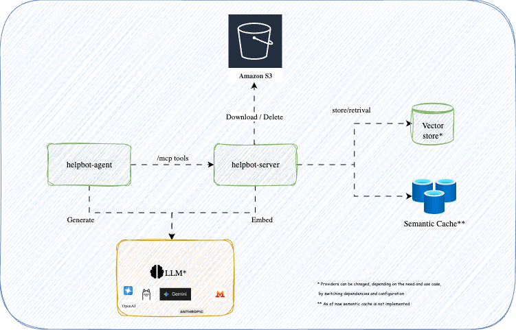
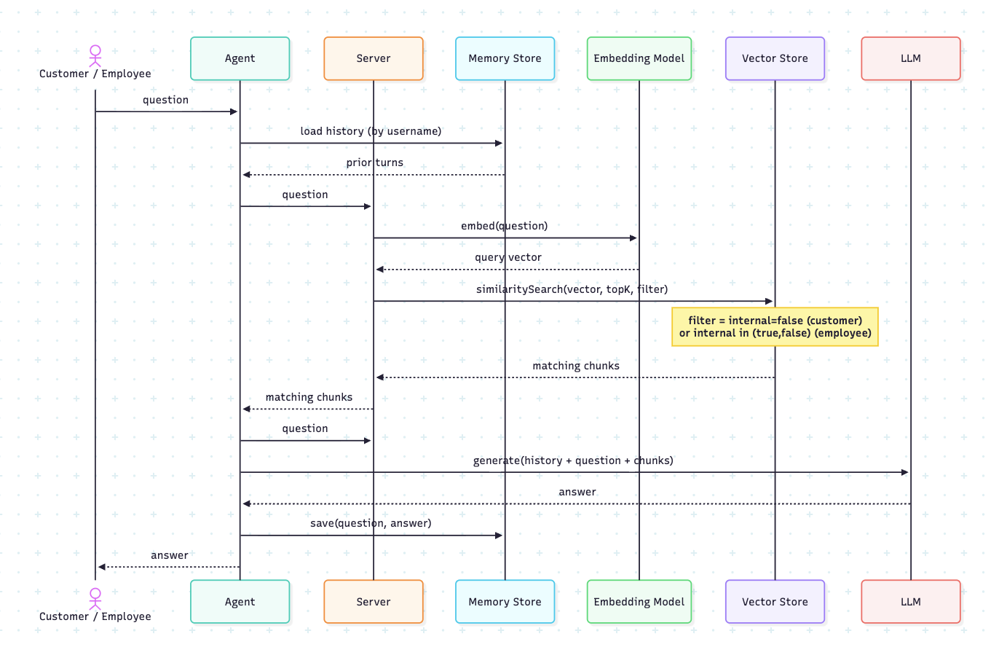
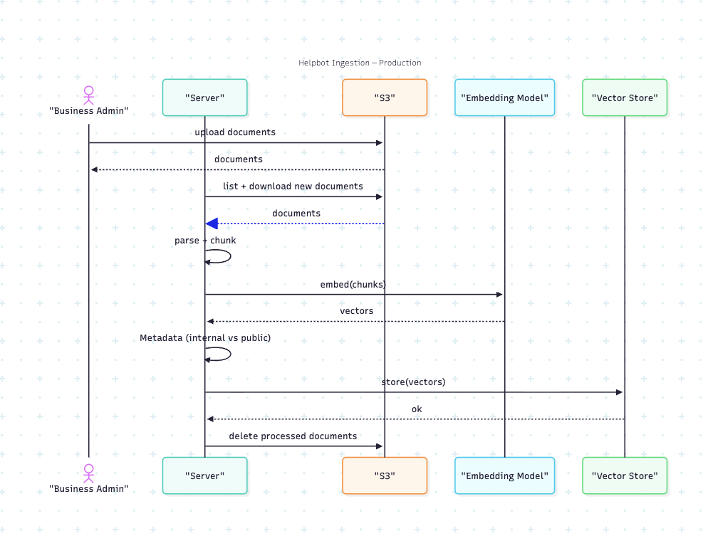

# Architecture

Cross-cutting look at how Helpbot works end to end. Per-module file layouts live in each
module's README; LLM guardrails specifically live in [AGENTIC-HARNESS.md](AGENTIC-HARNESS.md);
cost tradeoffs live in [TOKENOMICS.md](TOKENOMICS.md).

## RAG

Retrieval is an MCP tool the model chooses to call, not a hardcoded pipeline step.

## Ingestion

## MCP

- `helpbot-mcp-server`: 4 tools over Streamable HTTP at `/mcp` — `search`, `search_admin`,
  `createHelpDeskTicket`, `getHelpDeskTicketsByUserId`.
- `helpbot-agent`: MCP *client* via `McpSyncClient`
  (`spring.ai.mcp.client.streamable-http.connections.helpbot-mcp-server.url`), connected
  **eagerly and synchronously at context startup** 

## Agent Loop

- The tool-calling loop here is entirely framework-managed, not a hand-written Java loop with
  explicit circuit breakers: `ChatClient.defaultTools(...)` hands Spring AI the tool list, and
  it repeats *call model → execute any requested tool → feed result back → call model again*
  until the model returns plain text.
- No application-level step limit, turn cap, or timeout — relies on Spring AI's internal
  defaults (plus the ~10s network timeout per MCP round trip). A model stuck alternating
  between `search` and `getHelpDeskTicketsByUserId` has nothing here stopping it early.

## Chat Memory

Cross-turn continuity is entirely `MessageChatMemoryAdvisor`'s job — no explicit session object
anywhere in `helpbot-agent`.

- **Keyed by username**, not a client-supplied conversation ID (`CONVERSATION_ID =
  getUserName()`). No parallel conversations per user, no "reset" affordance.
- **Tool calls don't inflate the memory window.** `MessageChatMemoryAdvisor` runs at its
  default position (no `.order(...)` override), so it persists only the final
  user question + final assistant answer per turn — not intermediate tool-call/response
  messages. A question that triggers two tool calls costs more tokens *for that request* (see
  [Tokenomics](#tokenomics)) but only adds 2 messages to memory.
- **20-message sliding window ≈ 10 turns** (`MessageWindowChatMemory`, Spring AI's default max
  size). Oldest messages evicted once full — no summarization/compression step, so context
  falls off a cliff at message 21 rather than degrading gracefully.
- **In-memory, no TTL, not shared across instances.** Default `InMemoryChatMemoryRepository` —
  no JDBC/Redis chat-memory starter on the classpath. Lost on restart, invisible to a second
  instance if scaled out, never expires by age (only the 20-message window bounds it).

## Agentic Harness

See [AGENTIC-HARNESS.md](AGENTIC-HARNESS.md). Summary:

## Tokenomics

See [TOKENOMICS.md](TOKENOMICS.md). Summary:

## Testing

Judge-LLM quality checks via **Spring AI's evaluation framework**
(`org.springframework.ai.chat.evaluation` — `RelevancyEvaluator`, `FactCheckingEvaluator`,
backed by `org.springframework.ai.evaluation.{EvaluationRequest,EvaluationResponse}`):
`helpbot-agent/src/test/.../evaluation/RagQualityEvaluationTest.java`.

- **Implemented:** a parameterized test scores three hand-picked `{question, context, answer}`
  fixtures — a grounded/relevant answer, a hallucinated one (detail not in context), and an
  off-topic one — asserting each evaluator's `isPass()` matches expectation in both directions,
  so the test would actually fail if the evaluators stopped discriminating. Builds its own
  minimal Spring context (`ApplicationContextRunner` + `OpenAiChatAutoConfiguration` +
  `ChatClientAutoConfiguration`) to act as judge, rather than `@SpringBootTest`ing the real
  application — that would hit the MCP-client eager-connect gotcha for no reason, since this
  test doesn't need `helpbot-mcp-server` at all. Requires a real `OPENAI_API_KEY`; skipped
  (`@EnabledIfEnvironmentVariable`), not failed, without one, so it doesn't run against CI's
  placeholder key.
- **Not yet implemented:** the fixtures are illustrative, not derived from real seeded
  documents (this repo ships no committed seed content — see
  `helpbot-mcp-server`'s README); nothing yet drives the real `/chat` endpoint or the real
  `search`/`search_admin` retrieval to get golden questions scored end-to-end per role
  (public-only vs. public+internal); and it isn't wired into a CI gate the way
  `jacocoTestCoverageVerification` gates coverage today.
